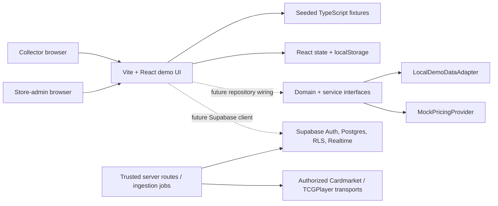
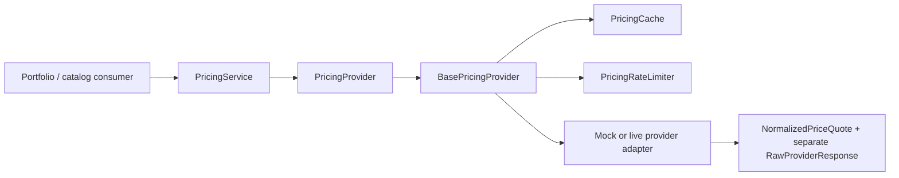
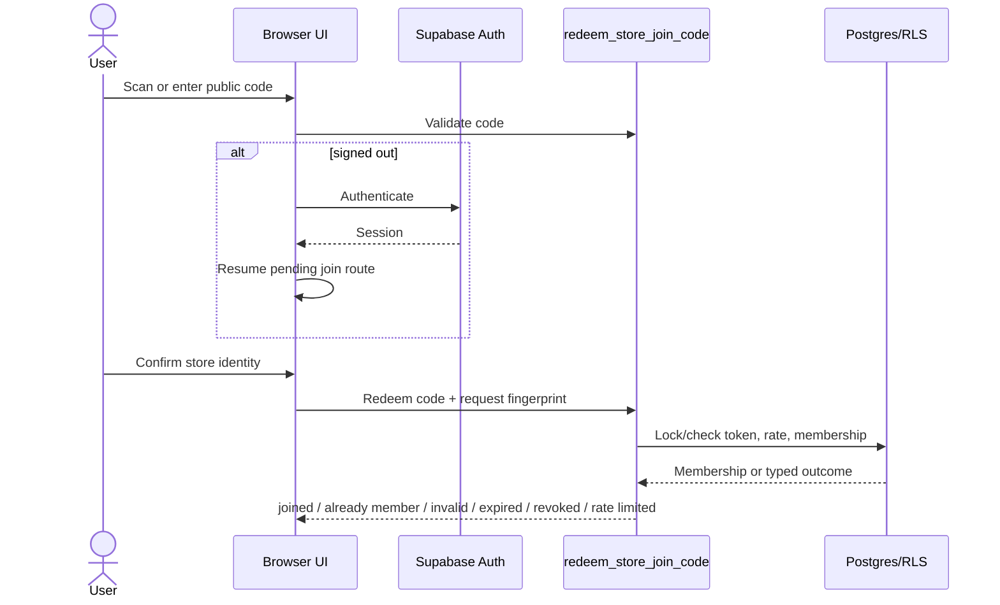
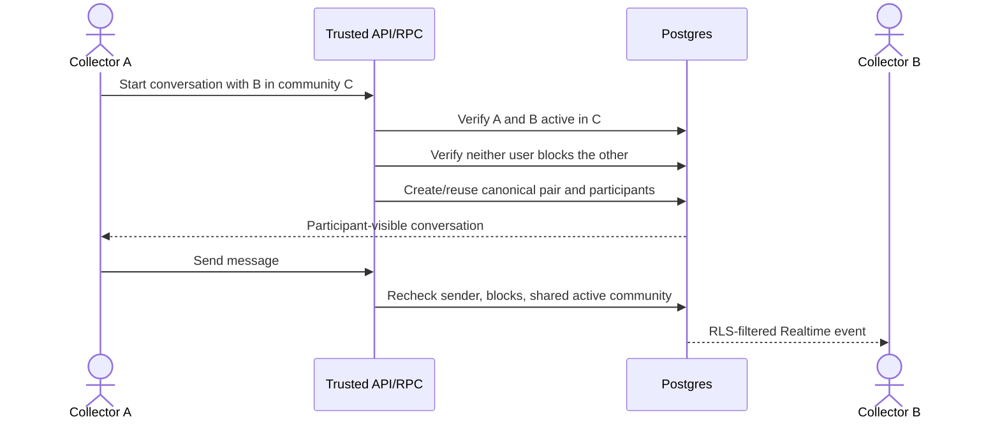
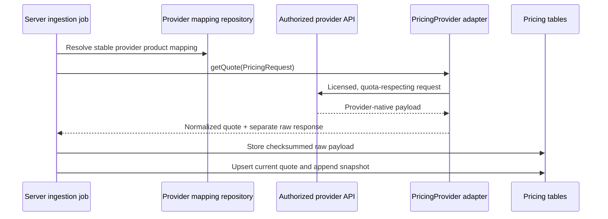

# TCG Harbor architecture

## Scope and design intent

TCG Harbor is structured as a One Piece Card Game demo with boundaries that can support additional games later. The current deliverable prioritizes a cohesive browser experience while also supplying the domain, provider, repository, authentication, and database contracts needed for a production migration.

The key architectural rule is to distinguish demonstration behavior from enforceable production behavior:

- React state and `localStorage` make the current single-browser walkthrough interactive.
- Pure domain modules express important business rules independently of React.
- Service interfaces separate consumers from local/demo and live-provider implementations.
- PostgreSQL constraints, triggers, RPCs, grants, and RLS define the intended trusted authorization boundary.

The browser demo is not itself a trusted authorization system.

## System context



Solid arrows are used by the current browser demo. Dotted arrows are integration seams present in the repository but not yet connected in `App.tsx`.

## Runtime truth table

| Capability | Current runnable UI | Reusable implementation | Production target |
| --- | --- | --- | --- |
| Authentication | Local session flag; email-shape validation | `AuthService` / `DemoAuthService` | Supabase Auth + server-verifiable session |
| Collection persistence | `tcg-harbor-assets` in `localStorage` | `DemoDataAdapter` + generic repository | Owner-scoped collection tables under RLS |
| Community/chat/trades/messages | React state for one browser | Pure domain authorization functions | Supabase tables, RPCs, RLS, Realtime |
| Pricing | Explicit values in UI fixtures | Normalized mock/live provider classes | Server ingestion into raw responses, quotes, snapshots |
| Store discovery | Fixture search + illustrative CSS map | Store/domain types | Geocoded store repository + MapLibre/OSM tiles |
| QR generation | Real SVG generation with `qrcode` | Domain join validation | Hashed, revocable database token RPCs |
| QR scanning | Permission-aware ZXing live-camera and uploaded-image decoding | Join-code domain rules | Server RPC redemption |
| Charts | Deterministic inline SVG | Portfolio/history calculations | Snapshot queries and accessible charting adapter |

## Frontend architecture

### Entry and navigation

`src/main.tsx` mounts `App`. `src/App.tsx` owns a lightweight history-based router and the main application state. It supports:

| Route | Current responsibility |
| --- | --- |
| `/signin` | Sign-in, sign-up, and reset demo states |
| `/dashboard` | Portfolio summary, period/source/type controls, chart, valuable holdings, gainers, and activity |
| `/collection` | Card/sealed tabs, search/filter/sort, grid/table views, detail/edit/remove flows |
| `/collection/add` | Catalog search, card/sealed forms, references, validation, and duplicate merge |
| `/market-comparison` | Exact-printing Cardmarket/TCGplayer ratio rankings normalized with the dated ECB EUR/USD rate |
| `/stores` | Store search, explicit geolocation request, list/map selection, and QR entry point |
| `/stores/:storeId` | Store profile, hours, directions, community preview, simulated join |
| `/communities` | Joined-community overview |
| `/communities/:communityId` | Member gate, chat, trades, members, and post creation |
| `/messages` | Conversation list and responsive message workspace |
| `/messages/:conversationId` | Selected private conversation |
| `/settings` | Profile, market/currency, notifications, privacy, and sign-out demo controls |
| `/store-admin` | QR SVG/poster generation, download, activation, regeneration, and admin-boundary presentation |
| `/scan` | Live camera decoding, uploaded-image decoding, manual code, and labelled demo simulation |
| `/join/:storeCode` | Valid, invalid, expired, already-joined, and successful join states |

The desktop shell uses a sidebar and the mobile shell uses a compact bottom navigation. CSS is split by responsibility:

- `styles.css`: tokens, shell, dashboard, collection, and shared foundations
- `styles-secondary.css`: secondary application surfaces
- `styles-community.css`: community, trade, messages, admin, scanner, and join flows
- `styles-responsive.css`: desktop-to-mobile adaptations
- `styles-market-comparison.css`: ranked comparison tables, methodology, sources, and responsive market-comparison layout

`components/ui.tsx` contains the shared UI primitives and inline SVG chart. `components/Icon.tsx` keeps icon rendering internal, avoiding an extra icon dependency. `data/demo.ts` contains all current browser fixtures.

### Current state ownership

`App.tsx` currently owns:

- collection assets and market/period/type selections;
- joined community IDs;
- chat messages;
- trade posts;
- direct-message conversations;
- toast and notification-panel state.

The UI writes collection assets to `localStorage` under `tcg-harbor-assets`. It writes the demonstration session marker under `tcg-harbor-session`. A pending post-authentication join route is held temporarily in `sessionStorage` under `tcg-harbor-pending-join`.

Other mutations are intentionally session-local and reset when the page reloads. The service adapter described below can replace this direct ownership, but is not yet the state source for `App.tsx`.

### Accessibility posture

The UI uses semantic landmarks, labelled form controls, explicit button labels, visible focus treatment, status regions, keyboard-operable modals/controls, responsive navigation, and non-color text for gain/loss and state communication. The custom map exposes labelled pin buttons, though a production map should add a fully equivalent list and more complete map keyboard semantics.

## Domain architecture

`src/domain/index.ts` is the public domain barrel. Modules contain no React or storage dependencies.

| Module | Responsibilities |
| --- | --- |
| `types.ts` | Extensible catalog, collection, pricing, store, membership, trade, DM, and block entities |
| `errors.ts` | Typed `DomainError` and error codes |
| `pricing.ts` | Native market/currency assertions, unavailable/stale handling, domain mock provider |
| `portfolio.ts` | Period boundaries, closest snapshot selection, quantity-at-time, holding and portfolio performance |
| `collection.ts` | Card/sealed insertion, identity, duplicate confirmation, and quantity merge |
| `community.ts` | Active-membership lookup, community access, code validation, redemption outcomes, duplicate prevention |
| `trade.ts` | Input parsing, rejection of price-like fields, read-only references, trade creation/current reference view |
| `messages.ts` | Shared-community and block checks, conversation creation, send/read privacy |
| `privacy.ts` | Owner-only collection projections and narrow public trade disclosures |

The domain suite in `src/__tests__/domain.test.ts` covers portfolio values and periods, missing history, quantity history, provider switching, card/sealed insertion, duplicate behavior, QR membership outcomes, community gates, price-free trades, read-only references, shared-community messaging, DM participant privacy, and collection/cost privacy.

## Service architecture

`src/services/index.ts` is the public service barrel.

### Composition

`createDemoServices()` creates an isolated graph:

```text
DemoServices
├── data: LocalDemoDataAdapter
├── auth: DemoAuthService
├── pricing: PricingService
│   ├── cardmarket: MockPricingProvider
│   └── tcgplayer: MockPricingProvider
└── repository<T>(collectionKey): AdapterDemoRepository<T>
```

Callers may inject another `DemoDataAdapter` to isolate tests, share a namespace, or replace browser storage. A later Supabase implementation can satisfy the same higher-level repository/auth responsibilities without changing domain calculations.

### Local data and repository boundary

`DemoDataAdapter` supplies asynchronous read/write/update/remove, session storage, and subscription operations. `LocalDemoDataAdapter`:

- stores schema-versioned, timestamped JSON envelopes;
- prefixes keys with the `tcg-harbor-demo` namespace by default;
- uses browser `localStorage` when available;
- listens for cross-tab storage changes;
- serializes in-process updates to avoid same-instance lost updates;
- falls back to an in-memory map when browser storage is absent or unavailable.

`AdapterDemoRepository<T>` adds list/get/create/update/remove/replace operations for entities with stable string IDs. It rejects duplicate IDs and distinguishes conflict from not-found failures.

Neither local storage nor the repository is an authorization boundary. Browser users can inspect and modify all locally stored values.

### Authentication boundary

`AuthService` defines session restore, sign-in, sign-up, sign-out, profile update, reset-request structure, and session-change subscription. `DemoAuthService` provides an offline implementation with a persistent browser session and demo password digest. It is explicitly documented in source as non-production authentication.

The current UI does not call this service; it uses the simpler `App.tsx` session gate. Production wiring should replace both with Supabase Auth and server-enforced authorization.

### Pricing provider boundary

The pricing service has four layers:



`PricingRequest` requires internal catalog item ID, asset type, provider product ID, language, condition, and card number for cards. Optional set/variant fields further disambiguate the listing. Requests do not use a display name as a matching fallback.

`NormalizedPriceQuote` includes:

- internal and provider catalog identifiers;
- provider, region, and native currency;
- nullable primary market value;
- named native provider price fields;
- condition, language, and variant;
- provider/fetch timestamps and calculated freshness;
- `live` or `demo` mode and an explicit source label;
- non-sensitive provider metadata;
- separately attributed currency conversion when present.

The untouched provider payload is returned separately as `RawProviderResponse`. This mirrors the database split between `provider_raw_responses` and `price_quotes`.

`BasePricingProvider` adds:

- a five-minute process-local cache by default;
- cache-hit freshness recalculation;
- in-flight request coalescing;
- sequential batch fetches;
- a fixed-window default guard of 20 requests per minute;
- provider/mode consistency checks.

`MemoryPricingCache` and `FixedWindowPricingRateLimiter` are single-process safeguards. Production needs shared/distributed enforcement in addition to provider and database limits.

#### Mock provider

`MockPricingProvider` resolves only exact explicit fixtures. A missing fixture returns a quote with `marketValue: null`, never zero. Every returned fixture is marked `dataMode: "demo"` and labelled `Demo market data — not live provider data`; no provider request is made.

#### Live provider classes

`CardmarketPricingProvider` and `TCGPlayerPricingProvider` accept injected `ProviderTransport` implementations. They normalize only fields supplied by the authorized transport, validate provider product ID and native currency, and preserve the raw response. They do not ship HTTP endpoints or infer undocumented provider responses.

The `assertServerOnlyCredentials()` guard throws if a caller constructs live credentials while `window` exists. This is defense in depth, not a substitute for server-only modules, secret management, or bundle inspection.

## Database architecture

The complete schema is in `supabase/migrations/202607160001_initial_schema.sql`. It targets PostgreSQL 15+ on Supabase and uses `auth.users` as the identity authority.

### Entity groups

| Area | Tables and views |
| --- | --- |
| Identity/preferences | `app_users`, `user_profiles`, `notification_preferences` |
| Extensible catalog | `games`, `card_sets`, `cards`, `card_variants`, `sealed_products` |
| Private portfolio | `collection_items`, `collection_quantity_history` |
| Pricing | `pricing_providers`, `provider_catalog_mappings`, `provider_raw_responses`, `price_quotes`, `price_snapshots` |
| Stores/access | `stores`, `store_administrators`, `communities`, `store_join_codes`, `store_join_attempts`, `community_memberships` |
| Community/trades | `community_messages`, `trade_posts`, `trade_post_offered_items`, `trade_post_wanted_items`, `trade_item_market_references` |
| Private messaging | `direct_conversations`, `direct_conversation_participants`, `direct_messages` |
| Safety/activity | `notifications`, `user_blocks`, `reports`, `activity_logs` |
| Narrow projections | `community_member_profiles`, `store_join_code_admin_view` |

Cards and sealed products share catalog-level patterns while retaining normalized subtype tables. Polymorphic rows use XOR constraints so a collection item, mapping, quote, snapshot, or trade item cannot point to both or neither asset types.

### Pricing persistence

`provider_catalog_mappings` uniquely binds provider/product/condition/language/variant to a card variant or sealed product. `provider_raw_responses` retains checksummed source payloads without client grants. `price_quotes` stores current normalized native values and cache/freshness/conversion metadata. `price_snapshots` stores periodic observations for historical performance.

Database triggers verify that quote targets, provider IDs, product IDs, condition, language, and variants agree with the stable mapping. Missing market values remain nullable, and an unavailable quote is constrained to a null market value.

Collection quantity changes are append-only in `collection_quantity_history`, allowing historical portfolio calculations to distinguish inventory changes from market movement.

### RLS summary

RLS is enabled on every application table. The principal boundaries are:

| Data | Read/write rule |
| --- | --- |
| Profiles/preferences | Current user only |
| Public catalog and active store previews | Anonymous/authenticated read; no public catalog writes |
| Collections and quantity history | Owner only; no store-admin or platform-role bypass |
| Provider configuration/mappings/quotes/snapshots | Authenticated normalized reads; trusted ingestion performs writes |
| Raw provider responses | No anonymous/authenticated API grant or policy |
| Join-code rows/attempts | No direct client table access; guarded RPCs only |
| Community membership directory | Active exact-community member or authorized moderator through narrow policies/view |
| Community messages and trade data | Active member of that exact community; author/moderator mutations as defined |
| Trade market references | Community members read; clients receive no write grant |
| Direct conversations/messages | Conversation participants only; store/community/platform roles do not grant message visibility |
| Notifications/activity | Owner only |
| Blocks | Blocking user controls mutation; involved-user visibility |
| Reports | Reporter plus exact-community/platform moderation policies |

Supabase's trusted `service_role` remains an operational RLS bypass and must never be exposed to the browser.

### Guarded workflows

Important RPCs include:

- `validate_store_join_code(code)`
- `redeem_store_join_code(code, request_fingerprint)`
- `create_store_join_code(store_id, label, expires_at, max_uses)`
- `deactivate_store_join_code(join_code_id)`
- `leave_community(community_id)`
- `moderate_community_membership(...)`
- `set_community_membership_role(...)`
- `create_direct_conversation(other_user_id, context_community_id)`

Production join codes are bearer tokens returned raw only at creation. The table stores SHA-256 hashes and a short non-secret prefix. Validation/redeem functions use row locks and enforce deactivation, expiry, use caps, duplicate membership, and attempt limits.

Direct-conversation creation proves both participants have an active shared community, checks bilateral blocks, canonicalizes the pair, and creates participant rows atomically. Sending a DM rechecks participant identity, blocks, and continued shared-community eligibility.

Triggers also enforce:

- community chat: 12 messages per minute;
- direct messages: 20 per minute;
- trade posts: 6 per hour;
- QR redemption: 10 attempts per 15 minutes;
- normalized/length-limited text and server timestamps;
- trade ownership/membership and no price field in the schema;
- system capture of read-only trade market references;
- append-only quantity events and target consistency.

### Realtime

The migration conditionally adds `community_messages`, `direct_messages`, and `notifications` to `supabase_realtime` and uses full replica identity. Realtime delivery still passes through each subscriber's RLS policy. The current React client does not subscribe to these publications.

## Core flows

### Community join



The browser fixture mirrors these outcomes locally but does not call the RPC.

### Direct conversation



Store administrators and moderators cannot read the conversation unless they are one of its two participants.

### Market ingestion



Provider credentials never traverse the browser.

## Seed architecture

`supabase/seed.sql` separates public and user-owned fixtures:

- Catalog, stores, communities, hashed demo codes, provider mappings, 31-day snapshots, raw responses, and current quote fixtures can load without Auth users.
- Profiles, collections, memberships, chat, trades, DMs, and notifications load conditionally when the documented Auth UUIDs exist.
- Auth users and password hashes are never inserted directly by the seed.
- All market fixtures use `demo_fixture`; none are represented as live data.
- Catalog image URLs remain null unless a permitted source is configured.

The SQL seed's development join tokens are listed near the top of that file and differ from the current frontend codes in `src/data/demo.ts`. They belong to separate adapters until Supabase wiring replaces browser fixtures.

## Production integration path

A defensible transition can happen incrementally:

1. Add `@supabase/supabase-js` and a browser-safe client using only the project URL and anon/publishable key.
2. Replace the `App.tsx` session flag with Supabase Auth while preserving the pending join route.
3. Implement catalog, collection, community, trade, DM, and notification repositories against the schema.
4. Move authorization-sensitive mutations to the supplied RPCs or trusted server routes; do not reproduce RLS decisions only in React.
5. Subscribe to the three RLS-protected Realtime publications and retain optimistic client IDs for retry/deduplication.
6. Replace fixture store search with geospatial queries and a MapLibre/OSM presentation while preserving the accessible synchronized list.
7. Submit the existing browser-decoded QR token to the guarded redemption RPC; retain upload/manual fallbacks.
8. Deploy authorized server-side pricing transports, a distributed cache/rate limiter, ingestion scheduling, raw-response retention, and snapshot jobs.
9. Add end-to-end tests against a disposable Supabase project, including multi-user RLS denial cases.
10. Add edge/WAF abuse controls, monitoring, backups, secret rotation, data-retention jobs, and moderation operations before production use.

## Validation strategy

Current automated validation is intentionally concentrated on pure business rules:

- Vitest exercises the high-risk portfolio, quantity-history, collection, join, community, trade, messaging, and privacy invariants.
- `npm run build` performs strict TypeScript checking before Vite bundling.

Recommended production additions:

- repository contract tests shared by local and Supabase adapters;
- provider normalization/cache/rate-limit tests with licensed-response fixtures;
- pgTAP or integration tests for every RLS allow/deny path and RPC outcome;
- Playwright flows for authentication resume, QR join, private-community denial, trade creation, and DM privacy;
- accessibility testing with keyboard traversal and automated WCAG checks;
- Realtime reconnect, duplicate delivery, offline retry, and blocked-user tests;
- load and abuse testing for chat, DMs, QR redemption, and price ingestion.

## Known architectural gaps

- The UI, service graph, and Supabase layer are not yet connected end to end.
- Browser auth is illustrative and not server verified.
- The current store map has no map tiles, geocoding, clustering, or distance computation.
- Camera and uploaded-image decoding are fully client-side and depend on browser media support and image quality; manual entry remains the universal fallback.
- Community, trade, DM, and notification mutations do not persist across reloads.
- Realtime and offline retry are presentation simulations.
- The provider cache/rate limiter is process-local and the live transports are intentionally absent.
- Store-admin code regeneration does not update the browser registry or database.
- The current UI aggregates missing quotes with display-oriented logic; production portfolio queries should use the tested domain calculators and explicitly exclude unavailable values rather than imply zero.
- Seed stores, users, messages, prices, and card visuals are illustrative fixtures, not verified live data or licensed artwork.
